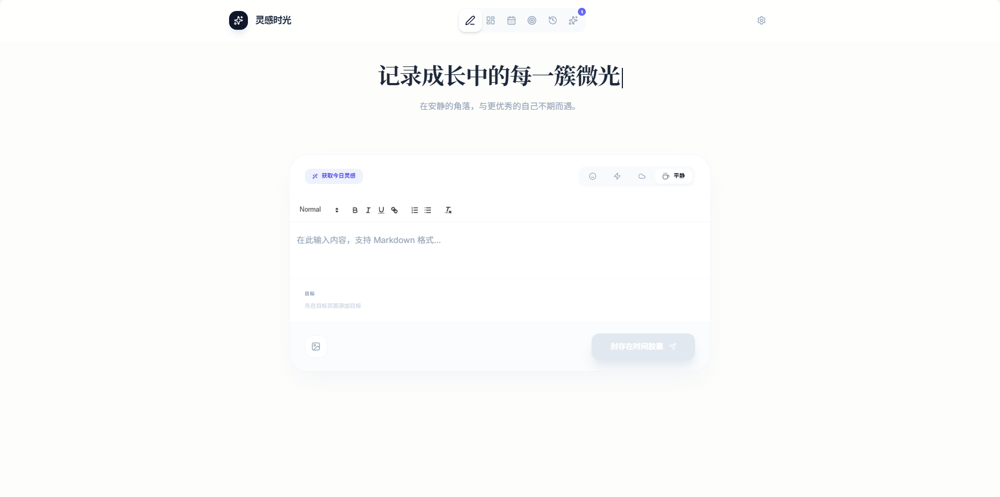

# 灵感时光 - AI 个人成长追踪

记录成长中的每一簇微光：专注于日常记录与目标追踪，并通过 AI 生成每日洞察与周期性总结，帮助你更清晰地看见自己的变化轨迹。

## 效果图



## 功能概览

- 日记记录与情绪标记，支持图文编辑
- AI 灵感提问与每日洞察（DeepSeek）
- 周期性成长总结与可视化看板
- 日历视图与历史时间轴
- 目标管理与完成标记、回收站
- 本地文件持久化（无需浏览器存储内容）

## 技术栈

- React 18 + TypeScript
- Vite 6
- Tailwind CSS（CDN）
- React Quill 编辑器
- Recharts 图表
- Lucide 图标
- DeepSeek API（Chat Completions）

## 本地运行

**环境要求：** Node.js 18+

```bash
npm install
npm run dev
```

默认访问：`http://localhost:5173`

构建与预览：

```bash
npm run build
npm run preview
```

## AI 配置（DeepSeek）

在「设置」中填写 DeepSeek API Key 后，AI 功能才会启用：

- 今日灵感提问
- 每日洞察
- 周期总结

提示：API Key 仅保存到浏览器配置中，不会写入本地文件。

## 本地文件存储

在「设置」中选择一个目录作为数据存储位置，系统会创建并维护：

```
ai_journal_data/ai_journal_state.json
```

特点：

- 数据不写入浏览器存储
- 适合长期本地保存
- 依赖 File System Access API，推荐使用 Chrome/Edge

## 目录说明（简）

- `App.tsx`：主界面与整体状态管理
- `components/`：核心 UI 组件
- `services/`：AI 与本地文件存储逻辑

---

如果你希望接入自己的后端存储或自定义 AI 模型，欢迎继续扩展。
